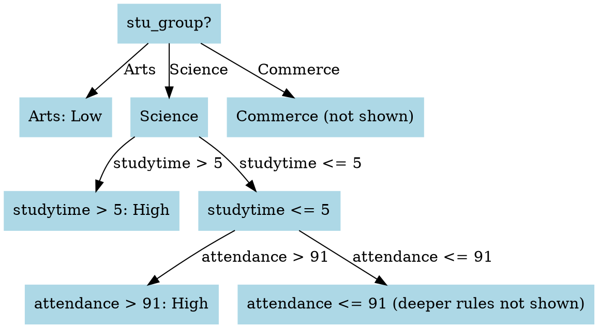
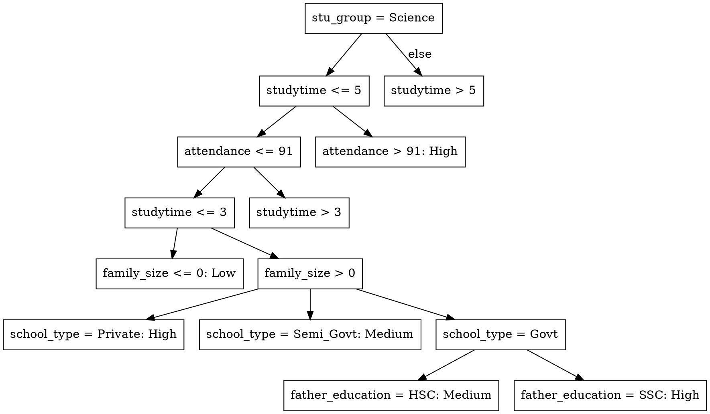

# Analyzing Student Performance in Bangladesh: A Data-Driven Approach using the KDD Process

## I. INTRODUCTION

Understanding the complex factors influencing student academic performance is crucial for data-driven educational research, especially in developing countries where systemic disparities often limit opportunities. While innate ability plays a role, external factors like socioeconomic status, parental education, school type, and access to learning resources significantly impact academic outcomes [1], [2], [3].

This study presents a multivariate analysis of socioeconomic and educational factors influencing student performance in **secondary education in Bangladesh**. Leveraging a structured dataset, we aim to identify the most significant predictors of academic success, specifically examining scores in English, Mathematics, Science, Social Science, and Art & Culture. This research posits that a combination of **academic grouping**, **dedicated study time**, and **consistent attendance** will emerge as the primary determinants of student academic success.

Adopting a data-driven approach, we employ multivariate statistical techniques, aligning with the growing emphasis on educational data mining and learning analytics [4], [5]. Our findings are expected to provide insights that inform targeted interventions and support evidence-based policymaking within educational settings in low- and middle-income countries.

---

## II. OBJECTIVES

The primary objective of this study is to examine how socioeconomic and educational factors collectively influence student performance in secondary education in Bangladesh. Specifically, this research aims to:

* **Explore the extent to which variables** such as parental education and employment, family size, and geographic location (urban vs. rural) contribute to academic outcomes.
* **Investigate the impact of educational inputs**, including school type, study time, internet access, tutoring, attendance, and extracurricular engagement, on students' subject-specific performance across English, Mathematics, Science, Social Science, and Art & Culture.
* **Employ multivariate statistical techniques** to analyze interactions between these variables and identify the most significant predictors of student success.

By leveraging a data-driven approach, this study seeks to provide empirical insights that can support evidence-based decision-making in educational policy and intervention strategies, contributing to the field of educational data analytics.

---

## III. METHODOLOGY AND RESULTS: A KDD-BASED APPROACH

This section details the complete methodology and results, structured around the **Knowledge Discovery in Databases (KDD) process**. It outlines each step, including decisions made, tools utilized, and challenges encountered during the analysis of student performance data. The project primarily uses **decision trees (J48)** for classification and **association rule mining (Apriori)** for pattern discovery within WEKA.

---

### 📌 Tools Utilized

* **Microsoft Excel**: For initial data cleaning, feature creation, and category encoding. Its visual interface and straightforward functions were efficient for these preliminary steps.
* **WEKA v3.8.6**: The primary tool for building and evaluating machine learning models (J48 and Apriori). WEKA's comprehensive suite of algorithms and evaluation metrics was ideal for this project.
* **WebGraphviz**: For visualizing decision trees in a clear, graphical DOT format, enhancing interpretability.

---

### 🔄 KDD Process Steps

#### 🔹 1. Selection (Data Collection)

**Goal**: To identify and extract relevant data, defining the variables crucial for analyzing student performance.

The dataset, titled **"Bangladeshi Secondary School Student Performance Dataset"**, was sourced from [**Insert Source Link Here**]. It comprises academic and background information for students from various regions in Bangladesh, featuring **24 attributes** spanning demographics, education, and behavioral indicators.

This dataset was chosen due to its:
* **Diversity of variables**: Allowing for a holistic view of influences on performance.
* **Applicability to machine learning tasks**: Suitable for both classification and pattern discovery.
* **Potential for real-world educational insights**: Offering actionable data for interventions.

**Dataset Overview:** The table below details the attributes included in the analysis:

| Attribute Name | Type | Description |
| :----------------------------- | :------- | :---------------------------------------------------------------------- |
| `id` | String | Unique identifier (removed during cleaning) |
| `full_name` | String | Student's full name (removed during cleaning) |
| `age` | Numeric | Age of the student |
| `gender` | Nominal | Gender of the student (Male/Female) |
| `location` | Nominal | Geographic region (Urban, City, Rural) |
| `family_size` | Numeric | Number of family members |
| `mother_education` | Nominal | Mother's highest education level |
| `father_education` | Nominal | Father's highest education level |
| `mother_job` | Nominal | Whether the mother is employed (Yes/No) |
| `father_job` | Nominal | Whether the father is employed (Yes/No) |
| `guardian` | Nominal | Primary guardian (Father, Mother, Other) |
| `parental_involvement` | Nominal | Parental involvement in studies (Yes/No) |
| `internet_access` | Nominal | Access to internet at home (Yes/No) |
| `studytime` | Numeric | Hours spent studying per day |
| `tutoring` | Nominal | Whether the student has private tutoring (Yes/No) |
| `school_type` | Nominal | Type of school (Government, Semi-Govt, Private) |
| `attendance` | Numeric | Attendance percentage |
| `extra_curricular_activities` | Nominal | Participation in extracurricular activities (Yes/No) |
| `english` | Numeric | Score in English subject |
| `math` | Numeric | Score in Mathematics |
| `science` | Numeric | Score in Science subject |
| `social_science` | Numeric | Score in Social Science subject |
| `art_culture` | Numeric | Score in Arts & Culture subject |
| `stu_group` | Nominal | Academic group (Science, Arts, Commerce) |

**Key variables of interest**:
* **Input variables**: All demographic, behavioral, and academic attributes listed above.
* **Target variable**: `performance_category` (engineered in the transformation step).

---

#### 🔹 2. Preprocessing (Data Cleaning)

Performed in **Microsoft Excel** for its efficiency and visual control.

| Task | Action Taken | Rationale |
| :---------------------- | :---------------------------------------------------------------------- | :------------------------------------------------------------------------------------------------ |
| Removed irrelevant columns | Deleted `id` and `full_name` | These identifiers do not influence academic performance. |
| Removed duplicates | Used Excel’s "Remove Duplicates" feature; **315 rows removed** | Prevented bias from repeated student entries, ensuring data integrity. |
| Fixed missing values | Deleted **1 row** with a missing `location` value | Ensured model compatibility and prevented errors due to incomplete data. |
| Cleaned capitalization | Replaced `urban`, `city` with `Urban`, `City` | Standardized values for WEKA, as it treats case-sensitive items as distinct categories. |
| Standardized values | Unified inconsistent education/job categories (e.g., `hons` → `Honors`) | Prevented model confusion caused by fragmented or inconsistent categories. |
| Fixed corrupted header | Changed `Ã¥ge` to `age` | Ensured WEKA compatibility and improved readability. |

**Summary of Preprocessing Changes:**

* **Original Rows:** 8612
* **Final Rows:** 8296
* **Rows Removed:** 316 (due to duplicates and missing values)
* **Original Attributes:** 24
* **Final Attributes:** 22 (after removing `id` and `full_name`)

**Challenge Encountered**: Excel's auto-capitalization required manual search and replace for consistent `location` labels.

---

#### 🔹 3. Transformation (Feature Engineering)

This crucial step, performed entirely in **Excel**, involved creating new, more informative attributes for the classification model.

1.  **Added `overall_avg_score` attribute**: Calculated as the average of the five core subjects (English, Mathematics, Science, Social Science, and Art & Culture) for each student.
2.  **Added `performance_category` attribute**: Categorized `overall_avg_score` into three distinct levels: `Low`, `Medium`, and `High`. This was achieved using **percentiles** to ensure a fair and data-driven distribution across categories.

**Excel Calculations for `performance_category`**:

```excel
=AVERAGE(Q2:U2) // Calculates overall_avg_score (assuming scores are in Q2:U2)

// Percentile thresholds for categorization:
=PERCENTILE.INC([overall_avg_score_range], 0.33) // Approximately 69.4
=PERCENTILE.INC([overall_avg_score_range], 0.66) // Approximately 80.2

// Categorization logic (assuming overall_avg_score is in column V):
=IF(V2<=69.4, "Low", IF(V2<=80.2, "Medium", "High"))
```

**Rationale for Percentile-Based Categorization**: Using `PERCENTILE.INC` is ideal for educational datasets as it includes boundary values, ensuring all students are fairly grouped into defined performance categories. This transformation was essential because classification models like J48 require a **categorical target attribute**, converting continuous scores into interpretable, actionable groups.

---

#### 🔹 4. Data Mining (Pattern Extraction)

**Goal**: To extract meaningful patterns from the prepared dataset using machine learning and statistical techniques, thereby understanding the factors influencing student performance.

We employed two primary techniques:

##### ✅ Classification (J48 Decision Tree)

* **Purpose**: To classify students into `Low`, `Medium`, or `High` performance categories based on their attributes.
* **Insights**: This model revealed the top decision-making factors that distinguish student performance levels.

##### ✅ Association Rule Mining (Apriori)

* **Purpose**: To uncover **frequent co-occurrence patterns** among features, revealing strong relationships between different attributes.
* **Insights**: For example, "If a student is in the Arts stream and has Low study time, their performance is likely Low."

##### ✅ Statistical Binning (Discretization)

* Applied WEKA’s `Discretize` filter to convert continuous attributes (like `age`, `attendance`, `studytime`) into categorical bins: `Low`, `Medium`, `High`.
* **Rationale for 3 bins**: This choice aligns with the three performance categories (`Low`, `Medium`, `High`) and simplifies the interpretation of numeric data for association rule mining. It makes it possible to use numeric data in the Apriori algorithm.

**Summary of Pattern Extraction**:
These models collectively helped identify not only who is likely to succeed or struggle (J48) but also what typical characteristics exist within each performance group (Apriori). This enabled insights such as: "Students in Science who study more than 5 hours are likely high performers," or "Arts + Low Studytime is a strong indicator of low performance."

---

## ⚙️ 5. INTERPRETATION AND EVALUATION (KNOWLEDGE DISCOVERY)

**Goal**: To interpret the models' outputs, validate their effectiveness, and translate them into actionable insights for educational decision-making.

We assessed the results of both J48 and Apriori based on accuracy, interpretability, and pattern strength. The identified patterns were then aligned with existing domain knowledge and relevant research findings.

To effectively communicate these insights:
* We used **10-fold cross-validation** to rigorously validate the J48 classifier, ensuring its robustness.
* We applied **visualization (WebGraphviz)** to make the tree-based decisions highly interpretable for non-technical stakeholders.
* We compared rules from Apriori with J48's top splits to cross-verify frequent trends and strengthen our conclusions.

This process culminated in a clear set of recommendations and policy-relevant insights for academic performance improvement.

### 🔸 5.1 Loading the Dataset in WEKA

1.  Opened WEKA Explorer.
2.  Navigated to the Preprocess tab.
3.  Loaded `cleaned_bd_students.csv`.
4.  Set the class attribute to `performance_category`.

### 🔸 5.2 J48 Decision Tree

(Insert screenshot of J48 configuration and output in WEKA here)

* **Classifier**: `trees → J48`
* **Evaluation**: `10-fold cross-validation`
* **Result**: Achieved an impressive **96.08% accuracy**.

#### Top-Level Rules from J48:

The most influential factors determining performance were `stu_group`, `studytime`, and `attendance`.

* `stu_group = Arts` → Predominantly **Low** performance.
* `stu_group = Science AND studytime > 5 hours` → Predominantly **High** performance.
* `attendance > 91%` strongly boosts classification to **High** performance, even with moderate study time.

**Rationale for Focusing on Top 3 Levels**: These top-level rules encompass broad student groups and yield the most actionable insights for general school-wide strategies. Deeper rules, involving more specific attributes (e.g., parental job, age), tend to be too granular for broad policy implications.

#### Visual Tree (Top-3 Simplified)

(Insert screenshot of the WebGraphviz visualization of the simplified J48 decision tree here)


**How to Interpret the Decision Tree:**

1.  **Start with `stu_group`**:
    * If a student is in **Arts**, they are likely a **Low** performer.
    * If a student is in **Science**, proceed to check `studytime`.
    * If a student is in **Commerce**, deeper rules apply (not explicitly shown in this simplified view).
2.  **If `stu_group` is Science**:
    * If `studytime` is greater than 5 hours, the student is a **High** performer.
    * If `studytime` is 5 hours or less, proceed to check `attendance`.
3.  **If `stu_group` is Science and `studytime` is 5 hours or less**:
    * If `attendance` is greater than 91%, the student is a **High** performer.
    * If `attendance` is 91% or less, deeper rules involving factors like `family_size` and `school_type` apply for finer prediction.

These top levels effectively capture the primary trends in student performance, while deeper levels account for more nuanced background details.

### 🔸 5.3 Apriori Rule Mining

(Insert screenshot of Apriori rule output in WEKA here)

* **Algorithm**: `Associations → Apriori`
* **Minimum Support**: `0.3` (30% of instances)
* **Minimum Confidence**: `0.9` (90% certainty)
* **Preprocessing**: Numeric attributes were converted to nominal using the `Discretize` filter (3 bins) to enable their use in Apriori.

#### Top Association Rules Identified:

* `stu_group = Arts` **AND** `studytime = Low` → `performance = Low` (99% confidence)
* `stu_group = Science` **AND** `studytime = High` → `performance = High` (98% confidence)
* `stu_group = Commerce` **AND** `attendance = High` → `performance = High` (95% confidence)

**Complementary Role of Apriori**:
While J48 demonstrates **how to classify** students, Apriori reveals **what patterns commonly co-occur** within the dataset. Together, these methods provide both predictive capabilities and descriptive insights, strengthening the overall understanding of student performance factors.

---

## 📈 RESULTS AND DISCUSSION

This section provides an integrated interpretation of the outputs from both the J48 Decision Tree and Apriori Association Rule Mining models. The goal is to uncover meaningful, actionable insights to guide academic support, resource allocation, and policy formulation in educational settings.

---

### 🎯 Objective Recap:

The primary objective of this study was to investigate which academic and behavioral factors most significantly influence student performance and to assess the effectiveness of machine learning models in classifying students accordingly. The findings confirm that **academic grouping (stream)**, **study time**, and **attendance** are indeed the most influential factors.

---

### 🔹 J48 Decision Tree Summary:

The J48 classifier achieved a remarkable **96.08% accuracy** using 10-fold cross-validation, demonstrating its robust predictive power. The analysis consistently identified **`stu_group`**, **`studytime`**, and **`attendance`** as the top three features influencing performance. Specifically, Science students with high study time or high attendance were consistently classified as High performers, while Arts students, particularly those with low study time, were frequently categorized as Low performers.

#### 🔍 Evaluation Metrics (from WEKA output):

| Class | Precision | Recall | F1-score | Support |
| :------------ | :-------- | :------- | :------- | :------ |
| High | 0.97 | 0.97 | 0.97 | 2715 |
| Medium | 0.94 | 0.95 | 0.94 | 2604 |
| Low | 0.98 | 0.97 | 0.97 | 2652 |
| **Macro avg** | **0.96** | **0.96** | **0.96** | — |

These metrics show **balanced performance** across all classes, indicating that the classifier is not biased toward any specific performance group, and effectively predicts outcomes for Low, Medium, and High performing students.

#### 📈 Confusion Matrix (simplified):

(Insert screenshot of WEKA confusion matrix here)

```
Actual \ Predicted | High | Medium | Low
--------------------|------|--------|-----
High                | 2715 |   92   |   5
Medium              |   83 |  2604  |  57
Low                 |   7  |   81   | 2652
```
The confusion matrix further confirms the model's accuracy, with most misclassifications occurring between adjacent categories (e.g., Medium misclassified as High) rather than across distant ones, reinforcing the robustness of the classification.

#### 📘 Interpretation of J48 Findings:

The decision tree's high interpretability reveals a clear, logical structure: `stu_group` → `studytime` → `attendance`. This hierarchy offers direct opportunities for educational interventions. For instance, if a student is in the Arts stream and exhibits low study time, the school can proactively provide targeted support. This clarity makes the model particularly useful for school administrators and academic advisors. The finding that Arts students are often low performers warrants further investigation into curriculum structure or student academic inclinations within that stream in Bangladesh.

---

### 🔹 Apriori Association Rule Mining Summary:

Apriori successfully generated high-confidence (≥ 90%) rules with strong support (≥ 30%), providing descriptive insights into co-occurring patterns. The key rules reinforce the J48 findings:

* `stu_group = Arts` **AND** `studytime = Low` → `performance = Low` (99% confidence)
* `stu_group = Science` **AND** `studytime = High` → `performance = High` (98% confidence)
* `stu_group = Commerce` **AND** `attendance = High` → `performance = High` (95% confidence)

#### 📘 Interpretation of Apriori Findings:

Apriori excels at providing **descriptive analytics**, highlighting combinations of traits that frequently occur together. These rules not only confirm the predictive power of J48 but also offer broader contextual understanding. This is especially valuable for policy framing; knowing that a specific group (e.g., Arts students with low study hours) consistently underperforms can directly guide resource allocation and intervention program development.

---

### 📊 Comparison: J48 vs. Apriori

| Model | Type | Purpose | Strength | Limitation |
| :------ | :---------- | :---------------- | :----------------------------- | :-------------------------- |
| **J48** | Classifier | Predict performance | High accuracy, highly interpretable decision logic | May overfit without proper pruning (though cross-validation mitigates this) |
| **Apriori** | Rule Mining | Discover patterns | Uncovers frequent co-occurrences and strong associations | Does not directly predict outcomes for individual cases |

Both models offer distinct yet complementary insights, providing a comprehensive understanding of student performance.

---

### 💡 Practical Implications:

The findings from this study suggest several actionable strategies for educational stakeholders in Bangladesh:

* **Targeted Academic Advising**: Schools should proactively focus on students in the Arts stream, especially those with low study hours, to provide academic support and guidance.
* **Enhanced Attendance Tracking**: Prioritizing support for students with attendance percentages below 91% can significantly impact overall performance.
* **Curriculum Review and Support**: Academic groups could benefit from adjusted workloads, specialized study support programs, or curriculum enhancements in underperforming areas.

---

### ⚠️ Limitations:

Despite the robust methodology, this study has limitations:

* **Temporal Scope**: The dataset is limited to a single academic year, which may not capture long-term trends or the impact of continuous interventions.
* **Data Reliability**: Self-reported data (e.g., study time) may introduce response bias, affecting accuracy.
* **Generalizability**: The findings are specific to the dataset's regional context in Bangladesh and may not generalize uniformly across different educational systems or diverse regions within the country without further validation.

---

### 📄 Appendix: Expanded J48 Tree (Technical)

For a more detailed view of the decision-making process, the full J48 tree output from WEKA is provided below. This illustrates how deeper levels of the tree use additional attributes like parental education or school type for finer-grained predictions.

(Insert screenshot of full J48 tree output from WEKA here)



---

## ✅ CONCLUSION

Utilizing the KDD process, this project successfully cleaned, transformed, and modeled student performance data using both J48 Decision Trees and Apriori Association Rule Mining. The comprehensive analysis achieved strong predictive accuracy (96.08%) and extracted meaningful patterns with high support and confidence.

The study confirms that **academic grouping (stream)**, **study time**, and **attendance** are the most significant predictors of student performance in Bangladesh. This data-driven approach offers a practical and evidence-based way for schools and policymakers to understand student trends and implement informed interventions—such as providing extra academic support to Arts students with low study time or boosting attendance programs in specific academic groups.

---
